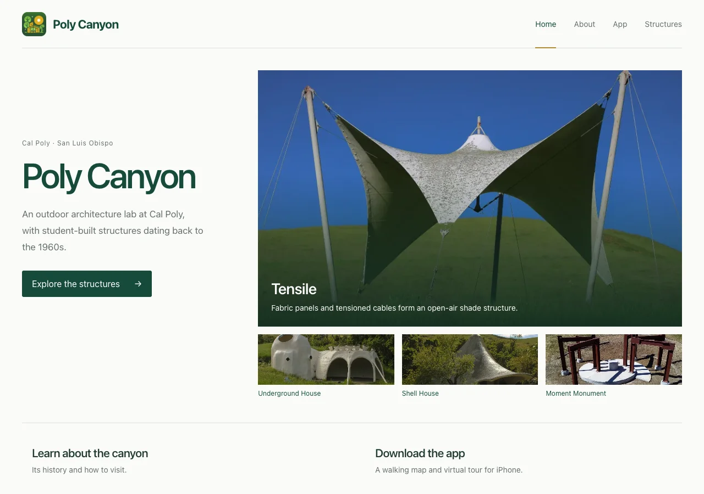
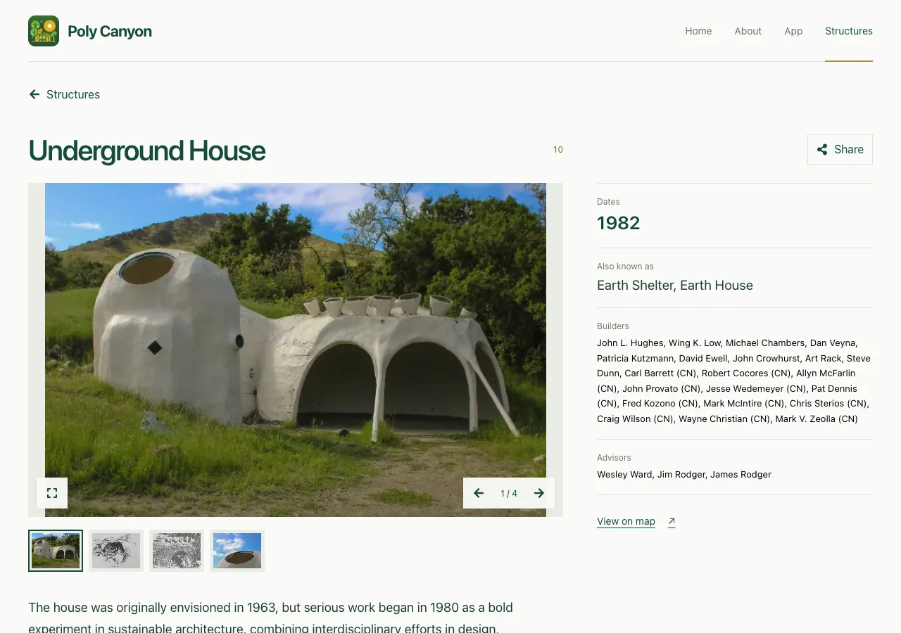

# Poly Canyon

An independent guide to Cal Poly’s outdoor architecture lab, where students have built experimental houses, bridges, and towers since the 1960s.

[Visit the website](https://polycanyon.com) · [Explore the structures](https://polycanyon.com/structures) · [iPhone app](https://polycanyon.com/app)

## About the project

I built this website to make the canyon easier to discover and its history easier to find. It brings photographs, original project reports, and research on 42 current and historical structures into one place, with practical information for anyone planning a visit.

The design starts with the photographs. Visitors can browse the structures, look through a gallery, and follow the research behind a project. The About page connects those individual experiments across six decades; the App page introduces the companion guide for exploring on foot.

## Behind the website

Built with React and Vite, published as a static site on Netlify. Structure histories also work without JavaScript. There are no accounts, analytics trackers, or database to maintain.

For local setup, content changes, and checks, see [maintenance](docs/maintenance.md). [Deployment](docs/release.md) covers publishing and rollback; [app media](docs/app-media.md) covers the phone previews.

Questions or corrections? [Contact Parker](mailto:parker.jones@live.com).
