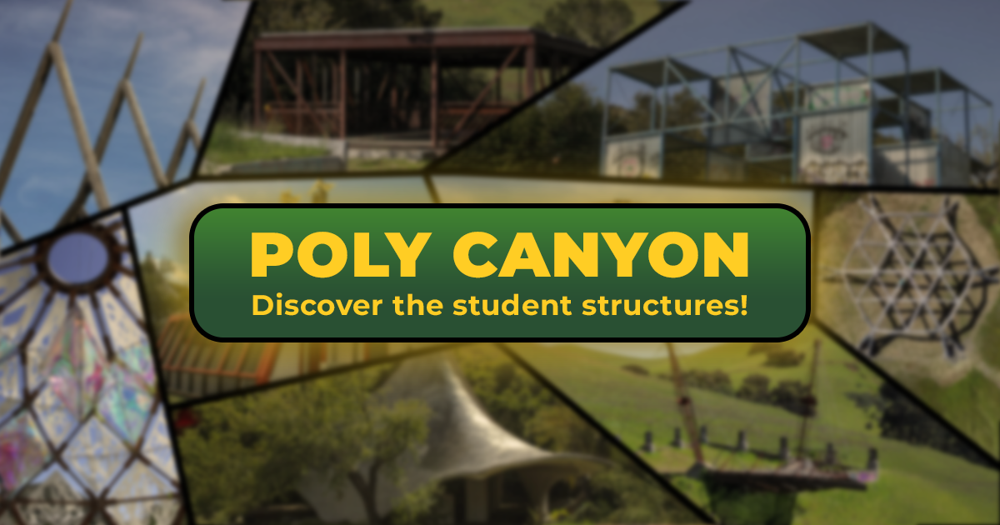

# Poly Canyon Website
## The Full Story, For the First Time

Welcome to the Poly Canyon Website – your digital archive dedicated to preserving and presenting the rich history of Poly Canyon in an engaging, accessible, and beautifully designed format. For too long, the legacy of this iconic Cal Poly landmark was lost in scattered, overly technical documentation. Here, I've distilled decades of history into one seamless resource.  
[Check it out!](https://polycanyon.com)

---

### What is Poly Canyon?

Poly Canyon is a landmark of creativity and history at Cal Poly. Over the decades, student-built structures have transformed this outdoor space into a living mosaic of art and architecture. Yet, the historical records were once scattered and inconsistent, making it difficult to piece together the full story. This website brings together those fragmented narratives—presenting them in a unified, user-friendly way that invites you to explore every hidden corner of Poly Canyon’s legacy.

---

### What Does the Website Do?

#### **Structures Page:**

Explore a comprehensive list of every structure in the canyon. Enjoy powerful sorting features that even catalog “ghost” structures—those that have vanished over time—ensuring no piece of history is overlooked.  

#### **Structure Info:**

  Dive deep into the details of each structure. Each dedicated page features:
  - High-resolution images (both current and historical)
  - The year of construction
  - Information on builders, advisors, and the story behind its creation
  - Location details and a full, engaging narrative  
  All presented in a clean, digestible layout.  

#### **Canyon Chronicles:**

  
  Experience an interactive journey divided into four captivating segments:
  - **History:** Trace the evolution of Poly Canyon over the decades.
  - **Land:** Discover the natural features and geographical context that shape the canyon.
  - **People:** Meet the visionaries—students, builders, and artists—whose creative endeavors left a lasting mark.
  - **Projects:** Learn about the various creative projects that have brought new life to this space.
  
  This immersive narrative offers a holistic view of the canyon, linking together its past, present, and future.

Additionally, you'll find detailed insights on the canyon as a whole, as well as seamless links to the Poly Canyon App for those looking to experience real-time exploration.

---

### How Does It Work?

This project was built with longevity in mind—a digital repository designed to outlive me. To achieve this, I chose a robust yet simple approach:

- **Static Data Repository:**  
  All information about Poly Canyon is stored in a centralized JSON file. During the build process, a script generates local JSON files from this master file. This centralized file leverages GitHub Gateway with Netlify to serve as a static database—offering the benefits of dynamic data management without the overhead of a live server.

- **CMS Integration:**  
  When updates are needed, our CMS triggers a Git commit that updates the JSON file. This, in turn, rebuilds and regenerates the website automatically—ensuring that the archive stays fresh and accurate with minimal fuss.

- **Modern, Responsive Design:**  
  Built with React and styled-components, the website features tailored designs for both mobile and desktop viewing, guaranteeing an optimal experience on any device.

---

### Final Thoughts

The Poly Canyon Website is more than just an archive—it's a personal labor of love that complements the Poly Canyon App by preserving a comprehensive and interactive record of this historic site. This project is close to my heart, and it's my commitment to ensuring that Poly Canyon’s legacy continues to inspire and inform for generations to come.

Thank you for exploring this digital archive. Join me on this journey to revive and celebrate a truly unique part of Cal Poly’s history.
